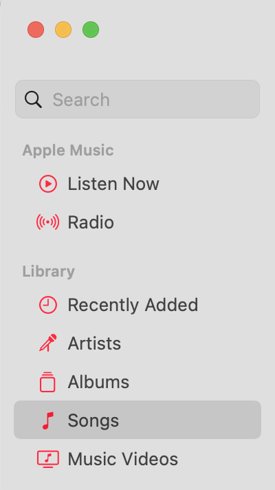

# Add Playlists to Apple Music in Batch

## Introduction

Let's say we have imported all music under `~/Music` to Apple Music Library through `File > Add To Library...`.
The music files are named, e.g., `1.m4a`, `2.m4a`, `3.m4a`, etc.
We want to create two playlists, one named `foo`, containing `1.m4a` and `4.m4a`, another named `bar`, containing `2.m4a` and `3.m4a`.
The classical approach is to select items in `Songs` panel of Apple Music app, and then select `Song > Add to Playlist > New Playlist`.
This works if the songs are added incrementally through time.
However, it soon becomes tedious if we already have a list of dozens of files to add, and have to add one by one.



This Python script is a solution to such problem.

### Other use cases

- [`cmus`](https://cmus.github.io) stores its playlists under `~/.config/cmus/playlists`. This script can be used to import `cmus` playlists into Apple Music.

## Usage

1. Export the library XML through `File > Library > Export Library...`. Suppose this is named `library.xml`.
2. Use the Python script to generate a playlist XML. Suppose this is named `playlist.xml`.
3. Import `playlist.xml` into Apple Music app through `File > Library > Import Playlist...`.

### Script command line usage

Create a playlist named `foo` containing `1.m4a` and `4.m4a`, and write the playlist XML to `out.xml`:

```bash
python3 create_pl.py -n foo library.xml out.xml 1.m4a 4.m4a
```

For detailed usage, see `python3 create_pl.py --help`.

### Script Python console usage

We may also create a playlist XML grouping multiple playlists at once, so that only one import is required, by importing `create_pl` as a module inside Python console.
Again using the `foo` and `bar` example above:

```python
import create_pl
from pathlib import Path
bd = create_pl.PlaylistsBuilder(Path.home(), Path('library.xml'), True)
bd['foo'] = ['1.m4a', '4.m4a']
bd['bar'] = ['2.m4a', '3.m4a']
bd.build('out.xml')
```

We may either save this as a script besides `create_pl.py` and run it, or directly type this snippet into Python console.

As a matter of fact, the `main()` function of `create_pl.py` is a real-world demo of using the script as an importable module.

## Mechanism

1. Read the library XML using [`plistlib`](https://docs.python.org/3/library/plistlib.html).
2. Find the specified music file paths in the plist.
3. Extract related parts from the library plist and reorganize into a new playlist plist.

## Bugs

Tested (not thoroughly) under macOS Monterey, Apple Music Version `1.2.5.7`.
Bugs not found yet.

## Related projects

- [Add-to-Apple-Music](https://github.com/thatmanmatt/Add-to-Apple-Music)
